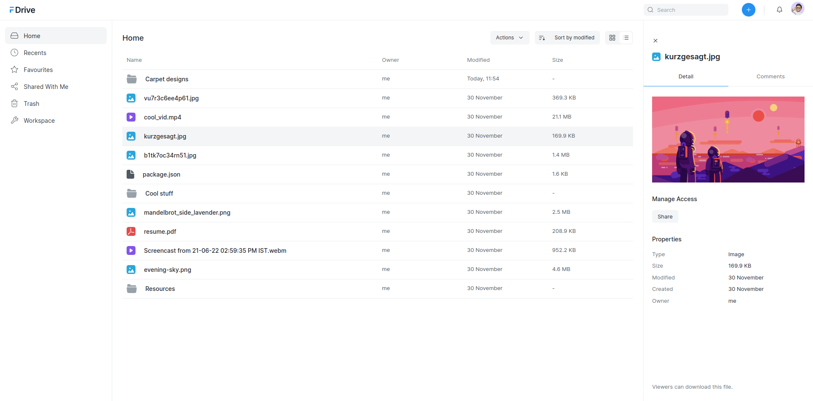
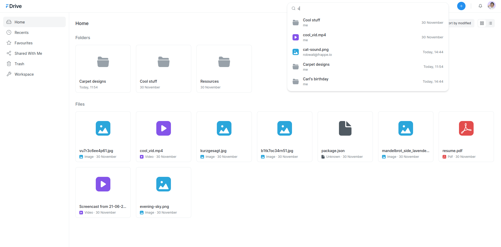
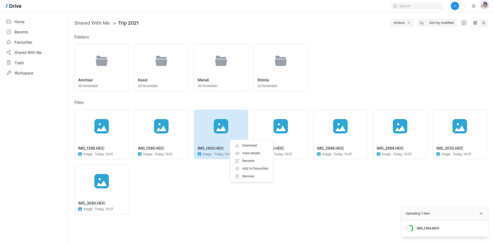
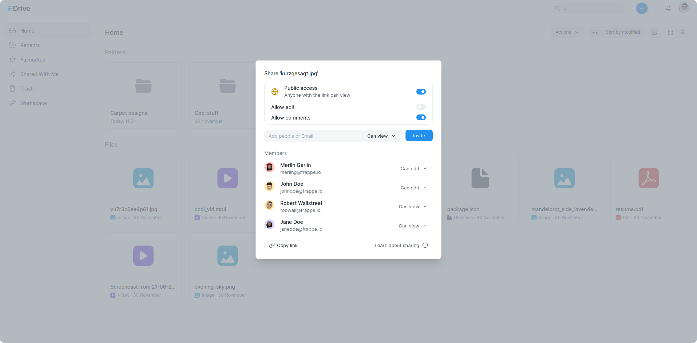

<div align="center" markdown="1">


#### **An easy to use, document sharing and management solution.**

</div>



<details>

<summary>More screenshots</summary>

<p>&nbsp;</p>



<p>&nbsp;</p>



<p>&nbsp;</p>



<p>&nbsp;</p>


</details>

## Features

- Upload and store files across multiple platforms.
- View files and folders in List or Grid view and sort them by preference.
- Preview files such as images, videos, PDFs, etc.
- Share files or folders with others and manage their permissions.
- Post comments on files shared with you.
- Add files or folders to _favourites_ to make them easily accessible.
- Use the Search Bar to search for any file or folder in your Drive.

## Installation

### Local

To setup the repository locally follow the steps mentioned below:

1. Install bench and set up a `frappe-bench` directory by following the [installation steps](https://frappeframework.com/docs/user/en/installation).

1. Move into your `frappe-bench` directory and get the Drive app
   ```sh
   bench get-app https://github.com/frappe/drive
   ```
1. Create a new site

   ```sh
   bench new-site drive.site
   ```

1. Map your site to localhost

   ```sh
   bench --site drive.site add-to-hosts
   ```

1. Install the app onto your site

   ```sh
   bench --site drive.site install-app drive
   ```

1. Start the bench server

   ```sh
   bench start
   ```

1. Start the frontend development server

   ```sh
   cd apps/drive && yarn dev
   ```

1. Finally, open the URL http://drive.site:8000/drive in your browser to see the app running.

## Contributions and Community

There are many ways you can contribute even if you don't code:

1. You can start by giving a star to this repository!
1. If you find any issues, even if it is a typo, you can [raise an issue](https://github.com/frappe/drive/issues/new) to inform us.

If you want to contribute code then you can fork this repo, make changes and raise a PR. ([see how to](https://docs.github.com/en/pull-requests/collaborating-with-pull-requests/proposing-changes-to-your-work-with-pull-requests/creating-a-pull-request-from-a-fork))

## License

[GNU Affero General Public License v3.0](LICENSE)
