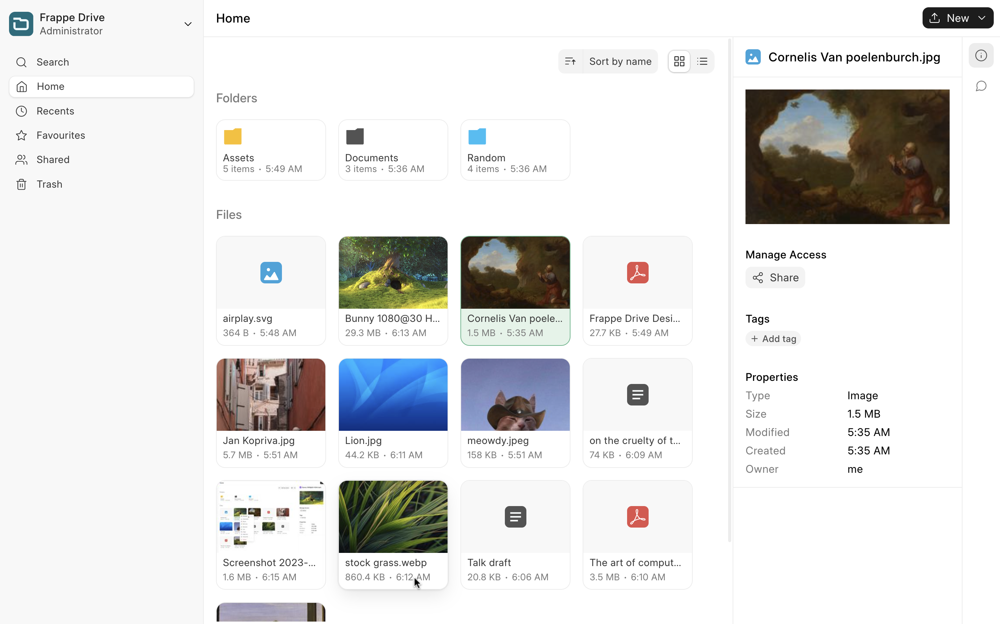
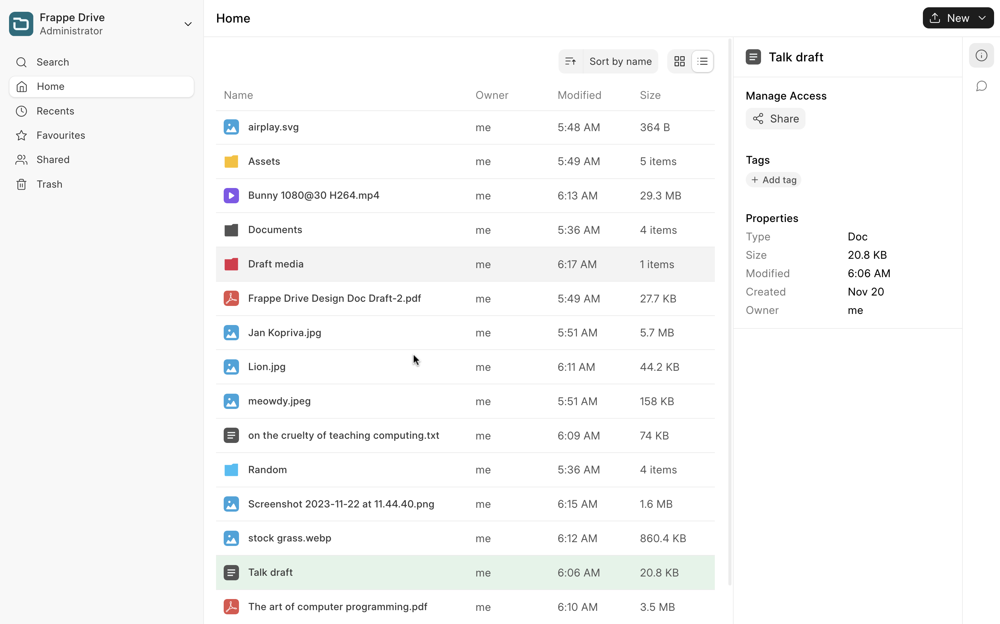
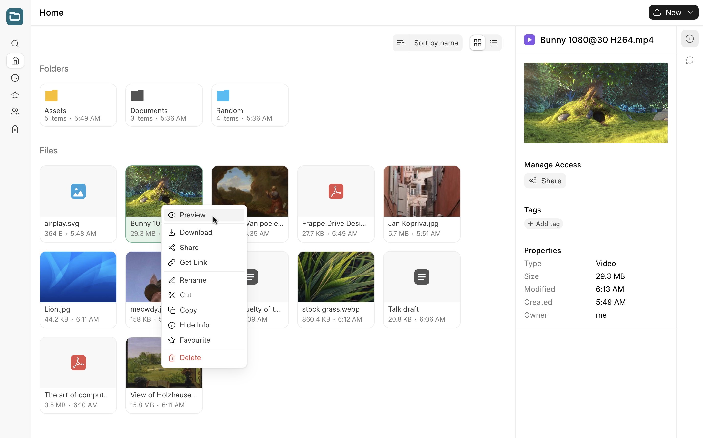
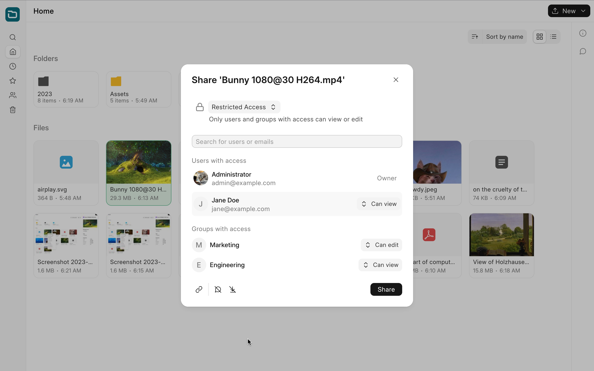
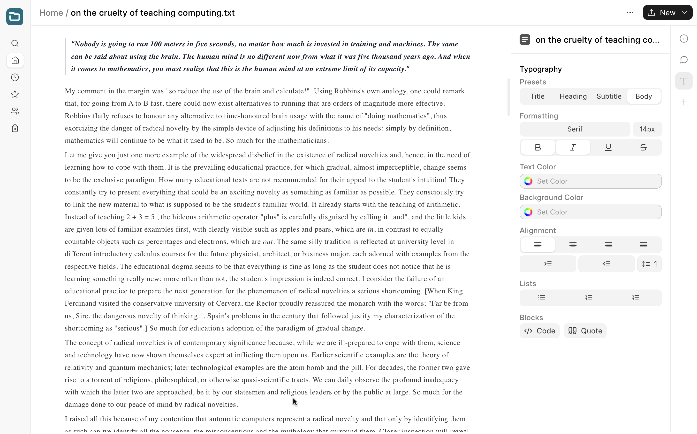
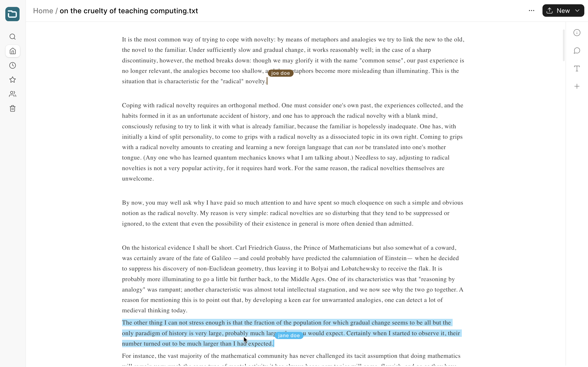

<div align="center" markdown="1">

<picture>
  <source 
   media="(prefers-color-scheme: dark)" 
   srcset=".github/logo_dark.svg">
  
</picture>

#### **An easy to use, document sharing and management solution.**

</div>



<details>

<summary>More screenshots</summary>

<p>&nbsp;</p>



<p>&nbsp;</p>



<p>&nbsp;</p>



<p>&nbsp;</p>


<p>&nbsp;</p>



<p>&nbsp;</p>



</details>

> **Warning**
>
> Frappe Drive is currently in beta, and will let breaking changes through, **do not** use it as your sole backup/data storage.

> **Note:** Frappe Drive is not currently accepting pull requests. File an issue to open a discussion to discuss an idea/feature request.

### Features

- Upload and store files across multiple platforms.
- View files and folders in List or Grid view and sort them by preference.
- Preview files such as images, videos, PDFs, etc.
- Share files or folders with others and manage their permissions.
- Post comments on files shared with you.
- Add files or folders to _favourites_ to make them easily accessible.
- Use the Search Bar to search for any file or folder in your Drive.
- Supports sharing files and folders with individual users and user groups.
- Ships with a robust document editor that seamlessly integrates with Frappe Drive and supports real time collaborative editing.

### Installation

To set up the repository locally, follow the steps mentioned below:

1. Install bench and set up a `frappe-bench` directory by following the [installation steps](https://frappeframework.com/docs/user/en/installation).

1. Move into your `frappe-bench` directory and get the Drive app
   ```sh
   bench get-app https://github.com/frappe/drive
   ```
1. Create a new site

   ```sh
   bench new-site drive.site
   ```

1. Map your site to localhost

   ```sh
   bench --site drive.site add-to-hosts
   ```

1. Install the app onto your site

   ```sh
   bench --site drive.site install-app drive
   ```

1. Start the bench server

   ```sh
   bench start
   ```

1. Start the frontend development server

   ```sh
   cd apps/drive && yarn dev
   ```

1. Finally, open the URL http://drive.site:8000/drive in your browser to see the app running.

### Contributions and Community

There are many ways you can contribute even if you don't code:

1. You can start by giving a star to this repository!
1. If you find any issues, even if it is a typo, you can [raise an issue](https://github.com/frappe/drive/issues/new) to inform us.
<!-- If you want to contribute code then you can fork this repo, make changes and raise a PR. ([see how to](https://docs.github.com/en/pull-requests/collaborating-with-pull-requests/proposing-changes-to-your-work-with-pull-requests/creating-a-pull-request-from-a-fork)) -->

### License

[GNU Affero General Public License v3.0](LICENSE)

### Warning

Frappe drive is currently marked as **beta** expect breaking changes between versions.

<!-- # Docker

This guide provides step-by-step instructions to install the project using Docker via VS Code Remote Containers extension.

## Prerequisites

Before you begin, make sure you have the following prerequisites installed on your system:

1. [Docker](https://docs.docker.com/get-docker/)
2. [Docker Compose](https://docs.docker.com/compose/install/)
3. User added to docker group
   ```shell
   sudo usermod -aG docker $USER
   ```
4. [VS Code Remote - Containers extension](https://marketplace.visualstudio.com/items?itemName=ms-vscode-remote.remote-containers)

### Step 1: Cloning frappe_docker repo

```shell
git clone https://github.com/frappe/frappe_docker.git
cd frappe_docker
```

### Step 2: Copy example devcontainer config from devcontainer-example to .devcontainer

Note:

Feel free to explore the files within devcontainer-example and make changes to the same, be that exposing DB ports or mount desired additional volumes.

```shell
cp -R devcontainer-example .devcontainer
```

### Step 3: Copy example VS Code config for devcontainer from development/vscode-example to development/.vscode.

This will set up basic configuration for debugging.

```shell
cp -R development/vscode-example development/.vscode
```

### Step 4: Open frappe_docker folder in VS Code(After the extensions are installed).

```shell
code .
```

Note:

The development directory is ignored by git.
It is mounted and available inside the container. Create all your benches (installations of bench, the tool that manages frappe) inside this directory.

### Step 5: Setup Bench

Run the following commands in the terminal inside the container. You might need to create a new terminal in VSCode.

```shell
# Use default environments
bench init --skip-redis-config-generation --frappe-branch version-14 frappe-bench
# Or set environment versions explicitly
nvm use v16
PYENV_VERSION=3.10.5 bench init --skip-redis-config-generation --frappe-branch version-14 frappe-bench

cd frappe-bench

```

### Step 6: Setup hosts

We need to tell bench to use the right containers instead of localhost. Run the following commands inside the container:

```shell
bench set-config -g db_host mariadb
bench set-config -g redis_cache redis://redis-cache:6379
bench set-config -g redis_queue redis://redis-queue:6379
bench set-config -g redis_socketio redis://redis-socketio:6379
```

For any reason the above commands fail, set the values in `common_site_config.json` manually.

```json
{
  "db_host": "mariadb",
  "redis_cache": "redis://redis-cache:6379",
  "redis_queue": "redis://redis-queue:6379",
  "redis_socketio": "redis://redis-socketio:6379"
}
```

### Step 7: Create a new site

Note: `sitename` must end with` .localhost` for trying deployments locally.

for example:

```shell
bench new-site mydrive.localhost --no-mariadb-socket
```

The same command can be run non-interactively as well:

```shell
bench new-site mydrive.localhost --mariadb-root-password 123 --admin-password admin --no-mariadb-socket
```

### Step 8: Set bench in developer mode on the new site

```shell
bench --site mydrive.localhost set-config developer_mode 1
bench --site mydrive.localhost clear-cache
```

### Step 9: Set current site

```shell
bench use mydrive.localhost
```

### Step 10: Install the Drive app onto the site created

```shell
bench get-app https://github.com/frappe/drive

bench --site mydrive.localhost install-app drive
```

### Step 11: Start Bench

Execute the following command from the `frappe-bench` directory.

```shell
bench start
```

### Step 12: Start the frontend development server

You are all set now :)

```shell
cd apps/drive && yarn dev
```

Finally, open the URL http://mydrive.localhost:8000/drive in your browser to see the app running.
 -->
